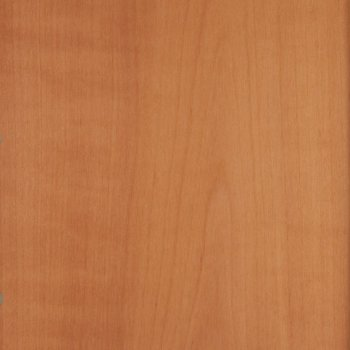
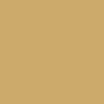
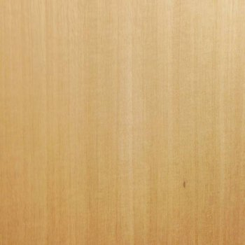
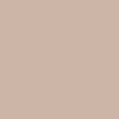

# Geometric bookmark patterns

Setup your own bookmarks! Build inlay frieze with different wood species. You are free to adjust:

- The number of pairs of triangles.
- The number of columns of triangles.
- The dimensions of the bookmark.
- The wood specie used for the background.
- Even and odd background wood species for triangles.
- Mind the cutting lines with show strokes option.
- Set if downloadable or not.
                

## Params

| Param title | Possible value |
| --- | --- | 
| `uniqueId` | an unique HTML id |
| `height` | from 100 to 1000 |
| `width` | from 100 to 300 |
| `background` | _see List of pattern species_ |
| `numberOfpairs` | from 1 to 15 |
| `evenPattern` | _see List of pattern species_ |
| `oddPattern` | _see List of pattern species_ |
| `showStrokes` | true/false |
| `columns_per_width` | from 1 to 15 |
| `can_download` | true/false |
| `patterns` | a javascript array of "string" values |


## List of pattern species

| Value | Show |
| --- | --- |
| Erable |  |
| Poirier |  |
| Sycomore |  |
| EtreBlanc |  |
| Citronnier |  |
| Chene Vanille |  |
| Cypres |  |
| Frene |  |

## Example of utilisation

_In a html file:_

```html
<div id="zone-demo"></div>
```

_In a javascript file:_

```javascript
    window.onload = function () {
        // Let's construct a non editable canvas without link.
        let canvasOfDemo = new BookMark('demo',
            300,
            300,
            "Frene",
            3,
            "Citronnier",
            "Cypres",
            false,
            1,
            true,
            ["Erable", "Poirier", "Sycomore", "Etre", "Citronnier", "Chene", "Cypres", "Frene", "Merisier"]
        );
    };
```

_It gives the following result:_

